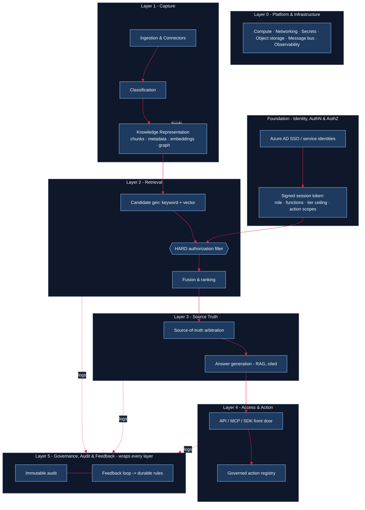
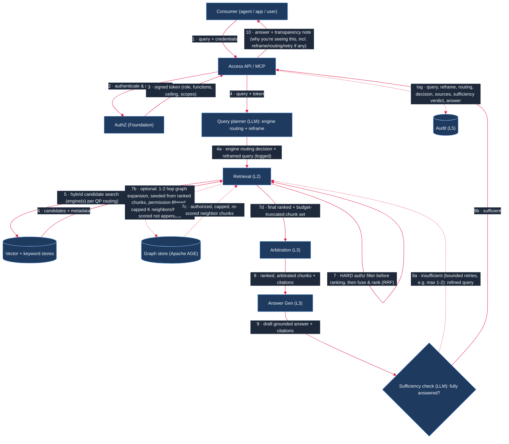
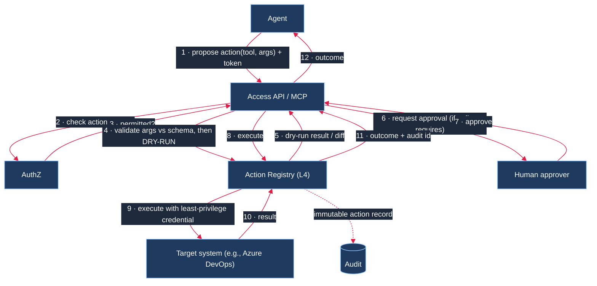
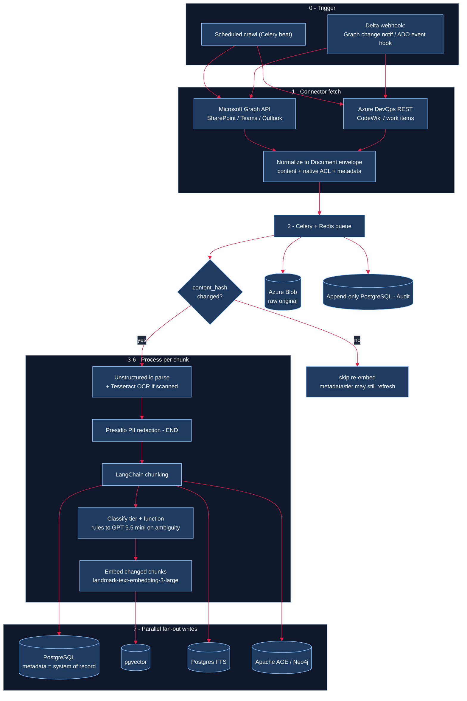
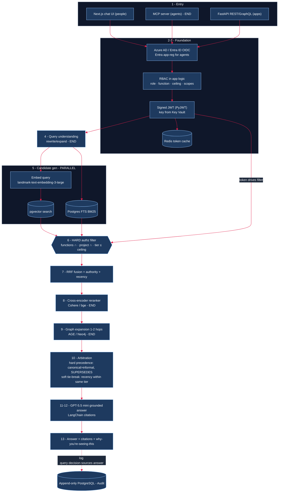
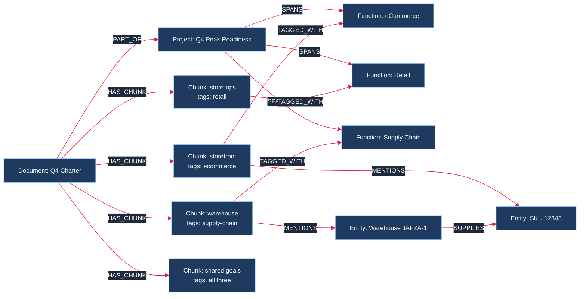
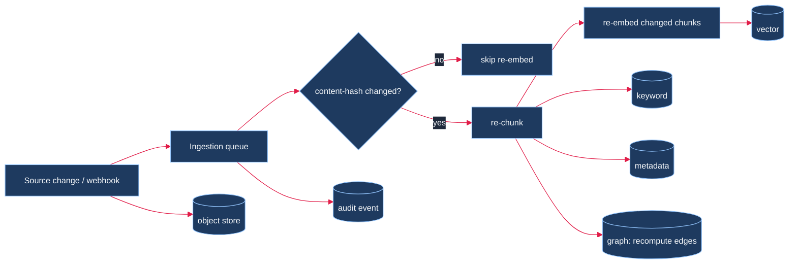

# Landmark Enterprise Knowledge Fabric — High-Level Design (HLD)

**A permission-aware enterprise knowledge & action layer that any AI agent, application, or employee can consume to understand the Landmark enterprise — and act on it safely.**

- **Scope of this document:** technical design for engineers and architects. It is the companion to the *Enterprise Knowledge Fabric Briefing* (the "what/why") and the *Detailed Architecture* diagram (the visual). This document is the "how".
- **Design principle in one line:** authorization is bound **before** knowledge is retrieved (early-binding), answers are **grounded** in authorized content only, and actions are **governed** exactly like knowledge.
- **Pilot:** Landmark **R&D team** — internal-first, ingesting **SharePoint + CodeWiki** documents. Every other business function reuses the same platform unchanged.

| | |
|---|---|
| Audience | Engineering, platform & security architects |
| Delivery model | R&D-built; **committed stack is Azure-leaning** (Azure AD, Azure OpenAI, Azure Blob, Key Vault) over self-hostable OSS data engines (PostgreSQL + pgvector + FTS, Celery + Redis); managed alternatives noted per component |
| Foundational identity | Azure AD (Entra ID) for people; Entra ID app registrations for agents & apps. **Authorization is RBAC (role + function grant + classification ceiling), enforced in application logic — no external policy engine** |

---

## 1. Problem statement — in plain English

The enterprise has a large amount of valuable knowledge, but that knowledge is spread across documents, meetings, work items, wikis and other systems. People often know that the information exists, but not where it is, which source is most relevant, how pieces of information connect, or whether the information is still current.

The product problem is intentionally broader than any one function: **how do we turn scattered enterprise information into connected, useful context that people and AI can use?**

The product story is expressed as six simple questions. These are the problems the Knowledge Fabric is intended to solve; the detailed technical design follows later in this HLD.

### The six core questions

| # | Problem question | Knowledge Fabric answer |
|---|---|---|
| **1** | **How do we collect all the enterprise information we already have and turn it into connected context?** | Automatically connect to enterprise sources, capture new and changed content, preserve the originals and metadata, and create a connected representation of documents, meetings, work items, people, applications, processes and other entities. |
| **2** | **How do we ask one question when the answer is spread across multiple systems?** | Understand the question, search the appropriate knowledge stores together, follow relevant relationships, combine evidence from multiple sources and produce one grounded answer rather than forcing the user to search each system separately. |
| **3** | **How do we make sure the right information reaches the right person?** | Apply relevance, source authority, freshness and authorization controls so the response contains information appropriate for that user and use case. Authorization is enforced before protected content reaches the LLM. |
| **4** | **How do we keep the enterprise context current as information changes?** | Continuously detect new and changed content, process only what changed, update metadata, embeddings, search indexes and relationships, and retain version/provenance so the fabric evolves with the enterprise. |
| **5** | **How do we know whether an AI answer is trustworthy?** | Ground answers in retrieved enterprise evidence, retain provenance and citations, prefer authoritative and current sources, and surface genuine conflicts instead of silently choosing one source. |
| **6** | **How do we move from finding information to letting AI use that knowledge and take action?** | Start with read-only knowledge access, then expose governed tools through a common access layer. Agents can propose actions, validate them, run dry-runs, obtain approval where required, execute with least privilege and record the outcome. |

### The maturity journey

**V0 / L0 — Capture & Connect**

> *Get the enterprise knowledge flowing automatically and turn it into connected context.*

**V1 / L1 — Surface**

> *Use that context to give the right information to the right person at the right time.*

**V2 / L2 — Act**

> *Allow governed AI agents to use that context and take action in enterprise systems.*

This sequencing deliberately keeps the initial problem simple. The first objective is not to solve every authorization, data-quality or agent-action scenario on day one. The first objective is to establish reliable automated capture and a useful enterprise context layer, then add stronger controls and capabilities as the platform matures.

### What this is — and what it is not

- **Not just a document repository:** the fabric connects content with context and relationships.
- **Not just a vector database:** semantic search is one retrieval mechanism alongside keyword, metadata and graph retrieval.
- **Not a fine-tuned company LLM:** enterprise knowledge remains external, current and governed; the LLM is a reasoning/generation layer grounded in retrieved context.
- **Not an all-at-once enterprise rollout:** start with a narrow R&D POC and expand the same platform pattern across functions.

---

## 2. Product examples — what the Knowledge Fabric should enable

The following examples are deliberately concrete so the architecture can be tested against business value.

### Example 1 — R&D: What has the team been working on?

**Question:** *“What has the R&D team been working on over the last month?”*

**Expected behavior:** The fabric combines recent SharePoint documents, designs, Azure DevOps work items and recorded Teams transcripts, groups the evidence into topics and summarizes the current state with source references.

### Example 2 — R&D: Explore a topic across conversations and documents

**Question:** *“Tell me more about the enterprise Knowledge Fabric work. What is the current state, and what discussions have happened about optimizing token cost?”*

**Expected behavior:** The system finds the relevant project context, follows relationships between documents, meetings and work items, and identifies where the topic was discussed rather than requiring the user to know which system contains the discussion.

### Example 3 — Cross-functional leadership: What is happening across the enterprise?

**Question:** *“What are the top topics my teams across eCommerce, Supply Chain, Retail, Marketing and Finance are working on?”*

**Expected behavior:** The fabric uses function/project relationships and recent evidence to create a cross-functional view, subject to the caller's access.

### Example 4 — Operational investigation: Why did something change?

**Question:** *“Why was the delivery promise logic changed for UAE last month?”*

**Expected behavior:** The query planner identifies **Delivery Promise**, **UAE**, **change**, and **last month** as the key concepts. The knowledge graph can reveal relationships such as Application → Repository → Azure DevOps Work Item → Teams discussion → Decision → Design/SOP → Incident. The retrieval layer then gathers authorized evidence from the relevant sources and the LLM synthesizes the reason with citations.

The system does **not** need a hard-coded rule saying “Delivery Promise means search Azure DevOps.” The relationships established during ingestion provide the navigation context that allows the retrieval layer to discover relevant systems and connected evidence.

---

## 3. Scope and implementation principles

### Initial source scope

The first implementation should remain intentionally narrow and useful:

- **SharePoint** documents/sites
- **Azure DevOps** Wiki/CodeWiki and work items
- **Recorded Teams meetings / transcripts**
- **Manual upload** as a fallback for content that cannot yet be connected automatically

The platform should be designed for additional connectors, but the POC should not attempt to solve every enterprise source. Deferred examples include SharePoint videos, Outlook shared mailboxes, ERP/CRM records, people/performance data and content that requires explicit exclusion rules.

### Capture-first principle

The first capture layer can intentionally be broad: **get data flowing automatically, then filter and govern it through subsequent stages**. This reduces the risk of building a complex relevance gate before the platform has enough real data to evaluate what is useful. Explicit exclusions and source-specific guardrails remain required before production onboarding.

### Identity and authorization

Identity and authorization remain mandatory for enterprise use, but they are treated as a **cross-cutting foundation** rather than the first product milestone. V0 can focus on controlled R&D data and basic access boundaries while the authorization model is hardened before broader enterprise exposure and before any protected context is sent to an LLM.

---

## 4. Architecture at a glance

The architecture is organized around a simple three-stage product journey agreed in the design review:

| Stage | Product goal | What the platform does | Scope |
|---|---|---|---|
| **V0 / L0 — Capture & Connect** | **Collect enterprise knowledge and create connected context** | Automatically capture content, normalize it, preserve the source, create metadata, chunk it, index it and establish initial relationships | **Immediate POC focus** |
| **V1 / L1 — Surface** | **Surface the right information to the right people** | Hybrid retrieval, relevance ranking, source authority, freshness and authorization-aware context assembly | **Next maturity step** |
| **V2 / L2 — Act** | **Enable agents to use knowledge and take action** | Governed tools, MCP, approvals, dry-runs and audited write-back to enterprise systems | **End state** |

These three stages sit on a set of technical capabilities: capture, knowledge representation, retrieval, source truth/arbitration, access, governance and action execution. Identity and authorization are **cross-cutting controls**, not the product story or a prerequisite that should delay the first capture milestone.

Eleven canonical capabilities are implemented as operating layers on shared platform infrastructure, with governance/feedback wrapping them.

| Operating layer | Canonical blocks | Responsibility |
|---|---|---|
| **Foundation — Identity & Authorization** | 01 | Authenticate the caller; issue a signed, short-lived token carrying role, function scope, classification ceiling, and action scopes. |
| **Layer 1 — Capture** | 02 Ingestion · 03 Classification · 04 Knowledge Representation | Pull content from source systems, classify it, chunk it, and store it in the retrieval stores + graph. |
| **Layer 2 — Retrieval** | 06 Retrieval & Ranking | Given a query + token, generate candidates, **hard-filter by authorization**, then rank. |
| **Layer 3 — Source Truth** | 05 Arbitration · 07 Answer Generation | Resolve/ surface conflicts by source authority; generate a grounded, cited answer. |
| **Layer 4 — Access & Action** | 08 API/MCP/SDK · 09 Actions & Tool Execution | One governed front door for consumption; a governed registry for actions/write-backs. |
| **Layer 5 — Govern & Learn** *(wraps all)* | 10 Feedback · 11 Governance & Audit | Immutable audit of everything; capture corrections and promote them to durable rules. |



> **In words** (for viewers that don't render Mermaid): **Layer 0 (Platform)** underpins everything. The **Identity foundation** authenticates the caller and issues a signed session token (role · functions · tier ceiling · action scopes). That token flows into the **hard authorization filter** in Retrieval. **Capture** (Ingestion → Classification → Knowledge Representation) writes the stores; Knowledge Representation feeds **Retrieval** (keyword + vector candidate generation → HARD authz filter → fusion & ranking) → **Source Truth** (arbitration → grounded answer generation) → **Access & Action** (API/MCP front door → governed action registry). **Layer 5 (Governance, Audit & Feedback)** wraps every layer and receives logs from Retrieval, Source Truth, and Access & Action.

### Golden rules (non-negotiable, enforced in code)
1. **Early-binding authorization** — filter by the caller's token *before* ranking or LLM context assembly. Never retrieve-all-then-hide.
2. **Chunk is the unit of permission** — not the document. A document's chunks may carry different tiers and functions.
3. **Grounding only** — the LLM answers strictly from authorized, retrieved chunks, with citations. Never fine-tuned on raw enterprise data.
4. **Content is data, never instructions** — ingested text can never steer the model (anti prompt-injection).
5. **Actions are governed like knowledge** — least-privilege, schema-validated, dry-run + human-in-the-loop where it matters, immutable audit.
6. **Everything is logged** — every query, answer, access decision, and action is auditable.

---

## 5. Layer 0 — Platform & Infrastructure

The plumbing every layer sits on. Nothing above is safe until this exists.

| Concern | Committed choice | Alternative / notes |
|---|---|---|
| Container orchestration / hosting | **AKS (Azure Kubernetes Service)** — committed | Azure Container Apps / App Service (not chosen) |
| Ingestion queue / task orchestration | **Celery + Redis** | Kafka / NATS event bus if streaming-scale fan-out is later needed |
| Object storage (raw blobs) | **Azure Blob Storage** | MinIO (self-host) |
| Secrets | **Azure Key Vault** | HashiCorp Vault (self-host) |
| Observability | **OpenTelemetry + Prometheus + Grafana + Loki** | Azure Monitor / App Insights |
| CI/CD | Azure DevOps Pipelines | — |

**Build first because:** identity, ingestion, and the data stores all depend on the queue, object storage, secrets, and observability being in place.

---

## 6. Foundation — Identity, Authentication & Authorization

A single unified layer. This is built **first among the real layers** — every downstream layer assumes the token exists.

- **Authentication:** Azure AD SSO (OAuth2 / OIDC) for people; **Entra ID app registrations** (client-credentials / workload identity) for agents and apps.
- **Authorization:** **RBAC** — admin-managed **role + function grant + classification ceiling**, assigned at onboarding and enforced **in application logic**. No external policy engine (no OPA / Cedar / Oso / Casbin). Fine-grained **ABAC attribute rules** and **per-action scopes** are an end-state extension of the same model.
- **Output:** a short-lived, signed **session token (JWT)** minted per query, cached in **Redis**; signing keys and secrets held in **Azure Key Vault**. Downstream layers trust the token, never the raw caller.

### 6.1 Session token claims
```json
{
  "sub": "u:asha.k | svc:kb-agent",
  "identity_type": "person | service",
  "roles": ["rnd-engineer"],
  "functions_allowed": ["rnd"],
  "classification_ceiling": "confidential",     // public < internal < confidential < restricted
  "action_scopes": ["kb.read", "ticket.create"],
  "project_grants": ["q4-peak-readiness"],       // cross-function allow-list (see §8)
  "iss": "landmark-authz",
  "iat": 1730000000,
  "exp": 1730000900                              // short-lived (minutes)
}
```

- **`functions_allowed`** enforces the per-function partition.
- **`classification_ceiling`** caps the tier of content this caller may ever see.
- **`project_grants`** is the *only* way to see cross-function content — explicit allow-list, never default-on.
- Every grant / change / revoke is written to the audit stream as an auditable event.
- **POC token** carries `sub · roles · functions_allowed · classification_ceiling` only; `action_scopes` and `project_grants` arrive with the action-execution and cross-function phases.

---

## 7. Layer 1 — Capture (Ingestion · Classification · Knowledge Representation)

### 7.1 Ingestion & connectors
- Per-source connectors pull **content + native permission signal + metadata**:
  - **SharePoint / Teams / Outlook** → Microsoft Graph API
  - **Azure DevOps** (wiki + work items) → Azure DevOps REST
  - New sources = a new connector implementing the same interface.
- **Sync modes:** scheduled full crawl + **Graph change notifications + delta query** (and Azure DevOps event hooks) for incremental sync where the source supports it.
- Connectors normalize every item into a common **Document** envelope and drop it on the **Celery + Redis** ingestion queue. A thin custom **connector SDK** (shared interface) is an end-state addition as source count grows.

### 7.2 Classification
- Rule-based classifier tags each chunk **Public / Internal / Confidential / Restricted**; the LLM assists on ambiguous content; owners confirm Confidential+.
- **Re-classification triggers automatically on document update.**
- Native source ACLs are captured and folded into an `effective_tier` — the system never trusts a looser tier than the source's own.

### 7.3 Knowledge representation (the store-writing step)
- **Chunking:** documents are split into semantically coherent passages. **The chunk — not the document — is the atomic unit of permission and retrieval.**
- Each chunk is written to: the **keyword index** (Postgres FTS / BM25), the **vector store** (pgvector embedding), the **metadata store** (PostgreSQL, system of record), and the **graph** (Apache AGE / Neo4j — nodes + edges). Raw file lands in **Azure Blob** object storage.
- **Hard-partitioned per function** via the `functions[]` tag on every chunk (see §9 for why this is a *label + query filter*, not physically separate databases).

> **Tooling — Capture layer:** parse **Unstructured.io**; OCR **Tesseract**; chunk with **LangChain**; embed with **Azure OpenAI `landmark-text-embedding-3-large`**; classify rule-based → LLM-assisted. **End-state:** entity/relation extraction (**spaCy + LLM**) and PII redaction (**Microsoft Presidio**).

### 7.4 Chunk metadata schema (system of record)
```json
{
  "chunk_id": "uuid",
  "document_id": "uuid",
  "source_system": "sharepoint",
  "source_uri": "https://landmark.sharepoint.com/...",
  "content": "…passage text…",
  "content_hash": "sha256:…",              // drives incremental re-embedding
  "embedding_id": "vec:…",
  "functions": ["ecommerce", "supply-chain"],  // multi-valued
  "classification_tier": "internal",
  "effective_tier": "internal",            // max(rule tier, native ACL tier)
  "owner": "team:ecom-content",
  "authors": ["u:…"],
  "project_ids": ["q4-peak-readiness"],
  "entities": ["sku:12345", "warehouse:JAFZA-1"],
  "created_at": "2026-08-01T…",
  "last_modified": "2026-08-10T…",
  "ingested_at": "2026-08-10T…",
  "version": 3,
  "superseded_by": null
}
```

---

## 8. Layers 2 & 3 — Retrieval, Arbitration & Answer Generation

### 8.1 Retrieval & ranking (Layer 2)

> **How does the fabric know which systems to trace?** It does not rely on a hard-coded “question → source” rule. During ingestion, the fabric builds an enterprise ontology and graph containing relationships such as **Capability → Application → Repository → Work Item → Meeting → Decision → SOP/Document → Incident**. Query understanding identifies entities, intent, time and scope in the user's question; graph/metadata relationships then provide candidate retrieval paths. The retrieval orchestrator combines those paths with vector and keyword search. This is what allows a question such as *“Why was the delivery promise logic changed for UAE last month?”* to discover Azure DevOps, Teams, incidents and design documents when those relationships exist.

0. **AI-driven query planning (pre-retrieval, agentic step)** — before any search engine runs, a lightweight LLM call inspects the incoming query and decides two things:
   - **Which engine(s) to invoke** — vector only (semantic/paraphrase-heavy questions), keyword/BM25 only (exact terms, IDs, error codes, proper nouns), both in parallel (the default), or vector+graph (multi-hop "why/how did X change" questions where entity relationships matter). This is a **routing decision**, not a hardcoded rule — it uses the same entity/intent/time/scope understanding described above, just made explicit and inspectable rather than folded silently into "always run hybrid."
   - **Whether to reframe the query** — expand abbreviations, resolve pronouns/context from conversation history, split a compound question into sub-queries, or rewrite a vague query into one better matched to how content is actually phrased in the corpus (HyDE-style rewrite is one option; query decomposition into 2-3 sub-queries is another for genuinely multi-part questions). Reframing is **logged alongside the original query** so retrieval remains explainable — the user-facing "why you're seeing this" block should show both the original and the reframed query when they differ.
   - This step is itself governed by the same authz token (it must not leak query intent/entities across function boundaries) and the same prompt-injection posture as answer generation (§8.3) — the query planner reasons about the query, it does not execute instructions found inside retrieved content, and at this stage no content has been retrieved yet.
   - **POC scope:** not built in Slice 1 (capture-only) or the initial retrieval slice; this is a Slice 2+ enhancement layered onto the fixed-hybrid baseline once basic retrieval is proven. See §19 open items for the specific design questions to resolve first.

1. **Candidate generation** — keyword (BM25) + vector search run in parallel (hybrid), per the engine-selection decision in step 0 (POC default: always run both, i.e. step 0 is a no-op until built). Each engine returns its own top-N candidates against the (possibly reframed) query; there is no separate graph search at this stage.
2. **Hard authorization pre-filter (mandatory gate)** — applied **before** ranking:
   ```text
   keep chunk IF
     ( chunk.functions ∩ token.functions_allowed ≠ ∅
       OR chunk.project_ids ∩ token.project_grants ≠ ∅ )
     AND rank(chunk.effective_tier) <= rank(token.classification_ceiling)
   ```
   Unauthorized-tier / out-of-function content is dropped here and **never reaches the LLM**.
3. **Fusion & ranking** — reciprocal-rank fusion (RRF) of the surviving keyword + vector lists into **one single ranked chunk list**, re-weighted by source authority (from arbitration) and recency. (Not "pick the best of 3 options" — RRF merges both lists into one ordering.)
4. **(Optional) graph expansion** — for multi-hop questions, traverse 1–2 hops (`REFERENCES`, `SUPERSEDES`, `PART_OF`) in **Apache AGE**, seeded from the **already-fused/ranked chunks** (not from the raw query). Traversal itself is permission-filtered — a neighbor the caller isn't authorized for is dropped even if the anchor chunk was fine. To prevent uncontrolled fan-out (e.g. a single anchor chunk connected to 10 other datasets/documents):
   - **Per-anchor neighbor cap** — at most **K neighbors per hop per anchor** (default `K=3–5`, configurable per function), selected by edge weight / recency / relevance — not "pull every connected node."
   - **Re-score, don't append** — graph-added chunks re-enter the same RRF/authority scoring used in step 3 and compete for a slot on equal footing; they are never appended raw on top of the fused list.
   - **Dedup by `chunk_id`** — a chunk reachable via keyword, vector, *and* graph is scored/counted once.
   - Net effect for a 10-related-dataset query: all 10 neighbors are *candidates*, but only the top-scoring, cap-respecting subset survives into context assembly — the other authorized-but-lower-relevance neighbors are dropped (not silently hidden for permission reasons — for relevance reasons, and this distinction is noted in the "why you're seeing this" transparency block).
5. **Context assembly** — the final ranked list (fusion output + surviving graph expansions) is truncated to a **fixed context budget** (max chunk count and/or max token budget for the answer-gen LLM call), citations retained per chunk. This is the enforcement point for "minimal authorized chunk set" — budget enforcement, not just an aspiration.

> **Tooling — Retrieval:** **pgvector + Postgres FTS** hybrid (managed alternatives: **Azure AI Search** / OpenSearch); **reciprocal-rank fusion (RRF)**; orchestrated with **LangChain**. **End-state:** cross-encoder **reranker** (Cohere / bge), **graph traversal** (Cypher / Gremlin / GraphRAG) with the neighbor-cap + re-score policy above, and the **AI-driven query planning (step 0) + post-answer sufficiency loop (§8.3a)** described in this section.

### 8.2 Source-of-truth arbitration (Layer 3a)
Arbitration runs on the **entire fused/ranked chunk set from §8.1**, every time — it is not gated on RRF producing a tie. It applies two distinct kinds of rule, in order:
1. **Hard precedence (can override RRF ordering outright):**
   - **Canonical sources outrank informal ones** — a canonical-tier chunk is preferred over an informal one even if the informal chunk scored higher in raw RRF. (Note: source authority is *already* one of the re-weighting factors inside RRF fusion, §8.1 step 3 — arbitration's canonical-vs-informal rule is the authoritative, final application of that same precedence, not a second independent vote.)
   - **`SUPERSEDES` edges drive versioning** — if a chunk's document has been superseded, the older version is demoted/dropped regardless of its RRF rank. This is version resolution, not a ranking tweak.
2. **Soft tie-break (only applies when hard precedence doesn't distinguish two chunks):**
   - **Recency breaks ties within the same source tier** — e.g. two canonical-tier chunks, or two informal-tier chunks, with no `SUPERSEDES` relationship between them. Recency is never used to let a newer informal-tier chunk win over an older canonical-tier one — tier precedence always wins first.
- Genuine conflicts (e.g. two same-tier, non-superseding sources that actually disagree in content) are **surfaced explicitly to the user**, never silently resolved by picking one.
- Arbitration rules are curated **per function** by that function's knowledge owner — configuration, not hardcoded logic. **POC** applies a fixed "most recent wins within a tier" rule (i.e., only the soft tie-break, since the POC arbitration engine is simple); the full **config-driven per-function arbitration rule engine** (hard precedence + soft tie-break, configurable per function) is end-state.

### 8.3 Answer generation (Layer 3b)
- The LLM (**Azure OpenAI GPT-5.5 mini**) generates a **grounded** answer from the authorized chunk set, with inline citations rendered via **LangChain**.
- RAG only — never fine-tuned on raw enterprise data.
- Ingested content is treated as untrusted data; conflicting sources are shown, not resolved away. Prompt-injection defense is prompt-level in the POC; a dedicated content-safety tool (**Azure AI Content Safety / Rebuff / Llama Guard**) is end-state.

### 8.3a Post-answer sufficiency check (agentic retrieval loop)

After the LLM produces a candidate answer from the current chunk set, a second, targeted check runs **before** that answer is returned to the caller:

- **Sufficiency judgment** — an LLM call (can be the same model, a cheaper/faster one, or a structured self-critique prompt on the same call) evaluates the draft answer against the original (and reframed, if applicable) query and asks: *does the retrieved context fully answer this, or is something missing — a sub-question unaddressed, a referenced entity never retrieved, an obvious multi-hop that stopped short?*
- **If sufficient:** answer proceeds to the caller as normal (§8.4 step 9).
- **If insufficient:** the loop triggers **one additional retrieval pass** — re-entering §8.1 with a refined/expanded query (informed by what the draft answer showed was missing), not a blind repeat of the same search. This is bounded, not open-ended:
  - **Hard iteration cap** (e.g. max 1–2 extra passes) to bound latency and cost — this is an *agentic* loop, not an unbounded agent; it must terminate and return the best-available answer with an honest "could not fully verify" caveat if the cap is hit rather than looping indefinitely.
  - Each additional pass still goes through the **same hard authorization pre-filter** (§8.1 step 2) — the sufficiency loop never bypasses authz to "try harder."
  - The extra pass(es) and why they were triggered are logged to Audit (Layer 5) alongside the original query/answer, so this remains inspectable, not a silent retry.
- **Relationship to arbitration/citations:** sufficiency checking is about *coverage* (did we retrieve enough), not *correctness* (is the retrieved content right) — arbitration (§8.2) and citation-grounding remain the mechanism for correctness; this step only asks "is anything obviously still missing."
- **Open design questions (not yet resolved — see §19):** what specifically triggers "insufficient" (a structured rubric vs. free-form LLM judgment), how the iteration cap interacts with the latency target in §16, and whether this should also feed the not-yet-built RAG evaluation/scoring layer (§15) as a signal, rather than being a purely runtime decision with no persisted quality score.
- **POC scope:** not built in Slice 1 (capture-only) or the initial retrieval slice — this is a Slice 2+ enhancement, same phase as the query-planning step in §8.1 step 0. Both should be designed together since they bracket the same retrieval call (planning before, sufficiency check after).

### 8.4 Query → answer sequence


> **In words** (for viewers that don't render Mermaid): The **Consumer** sends *query + credentials* to the **API**. The API authenticates with **AuthZ** and gets back a **signed token** (role, functions, ceiling, scopes). It passes *query + token* to a **Query planner** step, which decides which search engine(s) to invoke and whether the query needs reframing (both logged for explainability) — **end-state only, not in the POC baseline (see §8.1 step 0)**. **Retrieval** runs the resulting **hybrid candidate search** over the vector/keyword stores, applies the **HARD authorization filter *before* ranking**, then fuses via RRF into one ranked list. **Optionally** (multi-hop questions only), Retrieval then seeds a **1–2 hop graph expansion in Apache AGE from the already-ranked chunks** — itself permission-filtered, capped to K neighbors per hop per anchor, and re-scored into the same ranking rather than appended raw — before truncating to a fixed context budget. Authorized, budget-truncated candidates go to **Arbitration**, which hands ranked, arbitrated chunks + citations to the **Answer-Gen LLM**, producing a **draft** answer. A **sufficiency check** (also end-state, §8.3a) evaluates whether the draft fully answers the (reframed) query; if not, it triggers a **bounded** (e.g. max 1–2) additional retrieval pass with a refined query, still subject to the same authz filter — otherwise the draft becomes final. The API returns the answer to the Consumer with a *"why you're seeing this"* block (now also covering any reframe/routing/retry) — and logs the full trail, including reframe/routing/sufficiency decisions, to **Audit**.

---

## 9. Layer 4 — Access & Action

### 9.1 Access & consumption (08)
- **One governed front door:** REST/GraphQL API on **FastAPI**, with a **Next.js (React) chat UI** for people. An **MCP server** (**MCP Python SDK**, native agent plug-in) and an **OpenAPI-generated SDK** are end-state additions. The raw stores are never exposed.
- Every call carries the signed token; the response includes answer + citations + a *"why you're seeing this"* transparency block.
- Onboarding a new agent/app is **configuration**, not a new integration.

> **Tooling — Access:** **FastAPI** (REST/GraphQL) · **Next.js** chat UI. **End-state:** **MCP Python SDK**, OpenAPI-generated SDK, and the custom **action registry** (§6.2 — not in POC).

Representative surface:
| Endpoint / MCP tool | Purpose | Scope required |
|---|---|---|
| `POST /query` · `kb.query` | Ask a grounded question | `kb.read` |
| `GET /documents/{id}` · `kb.get_document` | Fetch authorized chunks of a doc | `kb.read` |
| `GET /graph/related?node=…` · `kb.related` | Relationship / backlink traversal | `kb.read` |
| `POST /actions/{tool}` · action tools | Invoke a governed action | specific `action.*` scope |
| `POST /feedback` · `kb.feedback` | Submit a correction | `kb.read` |

### 9.2 Actions & tool execution (09) — *end-state (not in POC)*
- A **governed registry** of permission-checked, schema-validated enterprise actions (create ticket, update record, trigger workflow).
- **Least-privilege · dry-run + human-in-the-loop approval · immutable audit per action.**
- Agents act **only** through this layer — never through bespoke, ungoverned integrations.



> **In words** (for viewers that don't render Mermaid): An **Agent** proposes *action(tool, args) + token* to the **API**. The API checks **action_scopes** with **AuthZ**; if permitted, it asks the **Action Registry** to validate args against the tool schema and run a **DRY-RUN**, which returns a diff/preview. If policy requires, the API routes to a **Human approver**; on approval, the Registry **executes against the target system** (e.g., Azure DevOps) using a **least-privilege credential**, receives the result, writes an **immutable action record** to **Audit**, and the API returns the **outcome + audit id** to the Agent.

### 9.3 Action approval policy (end-state — no actions in POC)
An approval policy is needed **only where an action changes state in a target system** (read/query paths never need it). The policy classifies each registered action; the mode is enforced by the registry (step 6 above).

| Action class | Examples | Approval mode |
|---|---|---|
| **Read-only / retrieval** | query, get document, graph lookup, dry-run preview | **Auto** — no approval (this is the entire POC surface) |
| **Low-risk write, in-scope, reversible** | add a comment, tag a work item, save a draft | **Auto** within caller's `action_scopes`; fully audited |
| **Standard write to a system of record** | create ticket / work item, update a field, trigger a workflow | **Human-in-the-loop** — dry-run diff must be approved |
| **Sensitive / high-blast-radius** | anything touching **Confidential/Restricted** data, **cross-function** writes, external comms (email/Teams), deploys | **Human-in-the-loop, elevated approver** |
| **Irreversible / bulk** | delete, mass update, destructive migration | **Human-in-the-loop + second approver**; often blocked entirely |

- Default is **deny + require approval**; auto-execute is the explicit exception, never the fallback.
- Every action — auto or approved — is dry-run-validated and written to the immutable audit trail.
- The specific per-class thresholds (what counts as "bulk", which functions demand a second approver) are confirmed with each function's owner at onboarding.

---

## 10. End-to-end workflows — document upload & user query

This section ties the layers together **operationally**: exactly which component runs, in what order (**sequential vs parallel**), and which store it writes or reads — for both the **POC** and the **end state**. It synthesizes Foundation (§3), Capture (§4), Retrieval & Source-Truth (§5) and Access & Action (§6); storage choices are per §13; the continuous-ingestion fan-out is per §11. Steps are tagged **`[POC]`** (in the pilot) or **`[END]`** (end-state).

Two journeys:
- **Journey A — Document upload / ingestion** (the asynchronous *write* path that fills the stores).
- **Journey B — User query** (the synchronous *read* / hot path that answers a question).

### 10.1 Journey A — Document upload / ingestion (write path)

The Capture layer is **fully asynchronous and decoupled from the query path** — a stalled crawl never blocks queries (§13). Everything runs off the **Celery + Redis** queue.



> **In words** (for viewers that don't render Mermaid): Ingestion is **triggered** by a scheduled crawl or a real-time delta webhook. A **connector** (Microsoft Graph / Azure DevOps REST) pulls *content + native ACL + metadata* and normalizes it into a **Document envelope** onto the **Celery + Redis** queue. A worker archives the **raw original to Azure Blob** in parallel, then checks the **content hash** — unchanged ⇒ skip re-embed; changed ⇒ **parse (Unstructured.io / Tesseract) → chunk (LangChain) → classify tier+function → embed only changed chunks (`landmark-text-embedding-3-large`)**. Results then **fan out in parallel** to four stores — **PostgreSQL** (metadata, system of record), **pgvector**, **Postgres FTS**, and the **graph (Apache AGE / Neo4j)** — and an **audit event** is written.

| # | Phase | Component / Tool | Seq / Par | Store written | POC / END |
|---|---|---|---|---|---|
| 0 | **Trigger** | Scheduled full crawl (Celery beat) **or** real-time delta: Graph change notification / Azure DevOps event hook | Sequential entry; sources crawled in **parallel** | — | `[POC]` SharePoint + CodeWiki only; `[END]` + Teams/Outlook |
| 1 | **Connector fetch** | Microsoft Graph API / Azure DevOps REST pull **content + native permission signal (ACL) + metadata**; normalize to common **Document envelope** | Parallel per source/item | — | `[POC]`; `[END]` adds **custom connector SDK** |
| 2 | **Enqueue** | Drop envelope on **Celery + Redis** queue; worker picks it up | Sequential handoff → parallel workers | — | `[POC]` |
| 2a | **Raw archive** | Write original file to **Azure Blob** | **Parallel** with the pipeline | **Azure Blob** | `[POC]` |
| 2b | **Dedup gate** | Compare `content_hash` (§4.4); unchanged ⇒ skip re-embed | Sequential | — | `[POC]` (idempotency is core) |
| 3 | **Parse** | **Unstructured.io** (docx/pdf/html); **Tesseract** OCR only if scanned | Sequential | — | `[POC]` |
| 3a | **PII redaction** | **Microsoft Presidio** at ingestion | Sequential | — | `[END]` |
| 4 | **Chunk** | **LangChain** semantic chunking → passages. **Chunk = atomic unit of permission** | Sequential | — | `[POC]` |
| 5 | **Classify (per chunk)** | Rule-based tier + function tags; `effective_tier = max(rule, native ACL)`; owners confirm Confidential+ | Sequential, **per chunk** | (feeds metadata) | `[POC]` rules; `[END]` **GPT-5.5 mini** on ambiguity + owner confirmation |
| 6 | **Embed (changed chunks)** | **Azure OpenAI `landmark-text-embedding-3-large`** — only chunks whose hash changed | **Parallel** across embedding workers | (feeds vector) | `[POC]` |
| 7 | **Fan-out writes** | All four stores below written **in parallel** | **Parallel** | 4 stores | `[POC]` |
| 7a | └ metadata | The §7.4 chunk schema (`functions[]`, `effective_tier`, `project_ids`, …) | Parallel | **PostgreSQL (system of record)** | `[POC]` |
| 7b | └ vector | Embedding vectors | Parallel | **pgvector** | `[POC]` |
| 7c | └ keyword | Tokenized text / BM25 | Parallel | **Postgres FTS** | `[POC]` |
| 7d | └ graph nodes | Document + Chunk nodes | Parallel | **Apache AGE** `[POC]` → **Neo4j** `[END]` | `[POC]` AGE |
| 8 | **Graph edge building** | Structural (`HAS_CHUNK`, `REFERENCES`, `FROM_SOURCE`) deterministic from metadata; `MENTIONS` via **spaCy + GPT-5.5 mini**; `SIMILAR_TO` via vector cosine threshold; `SUPERSEDES`/`CONTRADICTS`/`DEPENDS_ON` via **LLM extraction, verified before promotion** | Sequential, after nodes exist | **Graph (AGE/Neo4j)** | Structural `[POC-lite]`; semantic/typed `[END]` |
| 9 | **Cache + consistency** | Invalidate **Redis** for changed chunks; **re-classification to Restricted takes a fast priority lane** — a security event, not freshness (§11) | Sequential | **Redis** | `[POC]` |
| 10 | **Audit** | Emit ingestion event | **Parallel** | **Append-only PostgreSQL** | `[POC]` |

**Where metadata is generated:** steps 5–7a — **per chunk**, written to PostgreSQL as the system of record. Document-level provenance lives on the **Document node** in the graph (step 7d). The auth-bearing fields (`functions[]`, `effective_tier`, `project_ids`) always live **on the chunk**, so one document can yield chunks of differing tier/function (see §11.4).

### 10.2 Journey B — User query (read / hot path)

Synchronous. The non-negotiable rule: **authorization binds *before* retrieval/ranking, and the LLM never sees above-ceiling content** (Golden rules, §1).



> **In words** (for viewers that don't render Mermaid): A person (**Next.js UI**), app (**FastAPI**), or agent (**MCP server**, end-state) sends *query + credentials*. **Azure AD / Entra ID** authenticates; **RBAC in application logic** mints a short-lived **signed JWT** (role · functions · ceiling · scopes), signed with a **Key Vault** key and cached in **Redis**. Candidate generation runs the **vector search (pgvector)** and **keyword search (Postgres FTS/BM25)** **in parallel**. The **HARD authorization filter** — driven by the token, pushed down as a `WHERE` clause — drops out-of-function/above-ceiling chunks *before* ranking, so they **never reach the LLM**. Survivors are **fused (RRF, with a soft authority + recency re-weight)**, optionally **reranked** and **graph-expanded** (end-state), then **arbitrated** — arbitration applies **hard precedence** (canonical sources outrank informal ones regardless of RRF score gap; `SUPERSEDES` edges drop/demote superseded versions outright) and only falls back to a **soft recency tie-break** when two chunks are in the same source tier and neither supersedes the other. The result is handed to **GPT-5.5 mini** for a **grounded, cited** answer via **LangChain**. **FastAPI** returns *answer + citations + a "why you're seeing this" block*, and the whole transaction is logged to the **append-only audit trail**.

| # | Phase | Component / Tool | Seq / Par | Store touched | POC / END |
|---|---|---|---|---|---|
| 1 | **Entry** | **Next.js** chat UI (people) → **FastAPI** REST/GraphQL; agents via **MCP Python SDK** server. Query + credentials | Sequential | — | `[POC]` UI + FastAPI; `[END]` MCP + OpenAPI SDK |
| 2 | **Authenticate** | **Azure AD / Entra ID** OIDC (people); **Entra app registration** client-credentials (agents) | Sequential | — | `[POC]` |
| 3 | **Mint AuthZ token** | **RBAC in application logic** → role + `functions_allowed` + `classification_ceiling` (+ `action_scopes`, `project_grants` at END); sign **JWT (PyJWT)**, key from **Key Vault**, cache in **Redis** | Sequential | **Redis** (token) | `[POC]` token = `sub·roles·functions·ceiling`; `[END]` adds scopes + project grants |
| 4 | **Query understanding** | LLM rewrite/expand; decide if graph traversal needed | Sequential, optional, cached | Redis (cache) | `[END]` |
| 5 | **Candidate generation** | **Vector:** embed query (`landmark-text-embedding-3-large`) → **pgvector**. **Keyword:** **Postgres FTS** BM25. Orchestrated by **LangChain** | **PARALLEL** (both at once) | **pgvector** + **Postgres FTS** (read) | `[POC]` |
| 6 | **HARD authorization filter** | Pushed-down `WHERE`: `(functions ∩ token.functions_allowed ≠ ∅ OR project_ids ∩ token.project_grants ≠ ∅) AND effective_tier ≤ ceiling`. **Before ranking; unauthorized chunks never reach the LLM** | Sequential (mandatory gate) | PostgreSQL (read) | `[POC]` |
| 7 | **Fusion & ranking** | **Reciprocal-Rank Fusion (RRF)** of keyword + vector, re-weighted by **source authority** + **recency** | Sequential | — | `[POC]` |
| 8 | **Rerank** | Cross-encoder **Cohere Rerank / bge-reranker** | Sequential | — | `[END]` |
| 9 | **Graph expansion** | 1–2 hop traversal (`REFERENCES`/`SUPERSEDES`/`PART_OF`), seeded from post-fusion ranked chunks (not raw query), **itself permission-filtered**, **capped to K neighbors/hop/anchor (default 3–5, per-function configurable)**, re-scored into the same RRF/authority ranking (never appended raw), via Cypher/Gremlin/GraphRAG | Sequential, optional | **Graph (AGE/Neo4j)** (read) | `[END]` |
| 10 | **Arbitration** | `[POC]` fixed "most recent wins within a tier"; `[END]` **config-driven per-function rule engine**; genuine conflicts **surfaced, never silently resolved** | Sequential | PostgreSQL (rules) | `[POC]` fixed / `[END]` engine |
| 11 | **Context assembly** | Final ranked list (fusion + surviving graph expansions), **deduped by `chunk_id`**, truncated to a **fixed context budget** (max chunk count / max token budget) + citations retained | Sequential | — | `[POC]` |
| 12 | **Answer generation** | **Azure OpenAI GPT-5.5 mini** grounded RAG; **LangChain**-native citations; content treated as data, not instructions | Sequential | — | `[POC]` |
| 12a | **Content safety** | Prompt-injection defense: `[POC]` prompt-level separation; `[END]` **Azure AI Content Safety / Rebuff / Llama Guard** | Sequential | — | `[POC]` prompt-level / `[END]` tool (deferred) |
| 13 | **Respond** | **FastAPI** returns answer + citations + **"why you're seeing this"** transparency block | Sequential | — | `[POC]` |
| 14 | **Audit + observe** | Log query, decision, sources, answer → **append-only PostgreSQL**; traces via **OpenTelemetry + Prometheus + Grafana + Loki** | **Parallel** with response | **Append-only PostgreSQL** | `[POC]` |
| 15 | **Feedback** | `POST /feedback` (`kb.feedback`) → corrections captured → **reviewed → promoted to durable rules** | Async, later | PostgreSQL | `[END]` (`[POC]` = manual correction log only) |

> **Action / write-back path** is a separate end-state flow, **not** part of querying (the POC surface is read-only): propose action → check `action_scopes` → schema-validate → **dry-run diff** → human approval scaled by blast radius (§6.3) → execute with least-privilege credential → immutable audit.

### 10.3 Consolidated storage map (which DB holds what)

| Store | Engine | Written during upload | Read during query | POC / END |
|---|---|---|---|---|
| **Raw originals** | Azure Blob | Step A-2a | via citation link only | `[POC]` |
| **Metadata / system-of-record** | **PostgreSQL** | Step A-7a | Step B-6 (auth filter) | `[POC]` |
| **Vector** | **pgvector** (on Postgres) | Step A-7b | Step B-5 (semantic) | `[POC]` |
| **Keyword / BM25** | **Postgres FTS** | Step A-7c | Step B-5 (exact terms/SKUs/IDs) | `[POC]` |
| **Graph** | **Apache AGE** → Neo4j | Steps A-7d, A-8 | Step B-9 (multi-hop) | AGE `[POC]` / Neo4j `[END]` |
| **Cache** | **Redis** | Step A-9 (invalidate) | Step B-3 (token), B-4 (results) | `[POC]` |
| **Audit** | **Append-only PostgreSQL** | Step A-10 | governance reads | `[POC]` |

**POC in one line:** one PostgreSQL engine (pgvector + FTS + Apache AGE) + Redis + Celery + FastAPI + Next.js + LangChain + Unstructured.io/Tesseract (all OSS), plus Azure managed services (Entra ID, Azure OpenAI GPT-5.5 mini + embeddings, Blob, Key Vault, AKS). Everything tagged `[END]` (reranker, graph traversal, LLM classification, PII redaction, MCP, actions, feedback promotion, content-safety tool) layers on **without changing the stores**.

---

## 11. The data model & knowledge graph (end state)

This is the "relationship view" (Obsidian-style, but automatic and permission-scoped).

### 11.1 Node types
| Node | Meaning |
|---|---|
| **Document** | A source page / file / work item |
| **Chunk** | A passage of a Document — the permission & retrieval unit |
| **Entity** | Product/SKU, Person, Team, System, Policy, Vendor, Store/Location, Warehouse |
| **Project** | Cross-cutting initiative (stitches functions together) |
| **Function** | Business unit: eCommerce, Retail, Supply Chain, … |
| **SourceSystem** | SharePoint, Azure DevOps, Teams, Outlook |

*(Classification tier is an attribute on Chunk, not a node.)*

### 11.2 Edge types (all relations)
| Edge | From → To | Purpose |
|---|---|---|
| `HAS_CHUNK` | Document → Chunk | structure |
| `FROM_SOURCE` | Document → SourceSystem | provenance |
| `BELONGS_TO` | Document → Function | function partition (coarse) |
| `TAGGED_WITH` | Chunk → Function | function partition (fine) |
| `AUTHORED_BY` | Document → Person | authorship |
| `OWNED_BY` | Document → Person/Team | ownership |
| `MEMBER_OF` / `OWNS` | Person → Team → Function | org structure |
| `MENTIONS` | Chunk → Entity | meaning / entity graph |
| `RELATED_TO` | Entity → Entity | e.g., `SOLD_IN`, `SUPPLIES`, `STOCKED_AT` |
| `SIMILAR_TO` | Chunk → Chunk | soft semantic edge (from embeddings) |
| `PART_OF` | Document → Project | project membership |
| `SPANS` | Project → Function | **cross-function stitch** |
| `INVOLVES` | Project → Team/Person | project participants |
| `SUPERSEDES` | Document → Document | versioning → feeds arbitration |
| `REFERENCES` | Document → Document | hyperlink / citation |
| `CONTRADICTS` | Document → Document | surfaced conflict |
| `DEPENDS_ON` | Document → Document/Entity | dependency |

### 11.3 How edges are built
| Edge source | Technique | Trust |
|---|---|---|
| Structural (`REFERENCES`, `HAS_CHUNK`, thread/reply, `AB#1234` refs) | Deterministic, from ingestion metadata | Highest |
| `MENTIONS` / entity nodes | NER + entity linking (LLM-assisted) | High |
| `SIMILAR_TO` | Vector cosine similarity, thresholded + capped per node | Medium (soft) |
| `SUPERSEDES` / `CONTRADICTS` / `DEPENDS_ON` | LLM relation extraction (GraphRAG pattern) | Verified before promotion |

### 11.4 Cross-function storage — worked example
Project **"Q4 Peak Readiness"** touches eCommerce, Retail, and Supply Chain. A single charter document has storefront, store-ops, and warehouse sections.

- The document is ingested **once** and chunked; it is **not duplicated per function**.
- Chunks are tagged per section: storefront → `[ecommerce]`, store-ops → `[retail]`, warehouse → `[supply-chain]`, shared goals → all three.
- A **Project node** stitches them together across functions.
- **Visibility per viewer:** a Supply-Chain caller retrieves only the `supply-chain`-tagged + shared chunks. The full cross-function web is visible **only** to callers whose token carries `project_grants: ["q4-peak-readiness"]`.



> **In words** (for viewers that don't render Mermaid): The **Project "Q4 Peak Readiness"** `SPANS` three **Functions** — eCommerce, Retail, Supply Chain. The **"Q4 Charter" Document** is `PART_OF` that Project and `HAS_CHUNK` four chunks: *storefront* (`TAGGED_WITH` eCommerce), *store-ops* (Retail), *warehouse* (Supply Chain), and *shared goals* (all three). The storefront chunk `MENTIONS` entity **SKU 12345**; the warehouse chunk `MENTIONS` entity **Warehouse JAFZA-1**; and **JAFZA-1 `SUPPLIES` SKU 12345**. One document, stored once, chunked and tagged — the graph, not duplication, is what stitches the functions together.

**Rule of thumb:** *stored once as chunks · labeled with the function(s) each chunk pertains to · stitched by a Project node that SPANS functions · revealed per viewer by the permission filter.*

---

## 12. Where the LLM (and models) come into the picture

Two model classes are used: **embedding models** (text → vector) and the **chat LLM** (generation/extraction).

| # | Stage | Model | What it does | Guardrail |
|---|---|---|---|---|
| 1 | Ingestion | GPT-5.5 mini | Assist classification (suggest tier), smart chunking | Rules first; LLM only on ambiguity |
| 2 | Graph building | GPT-5.5 mini + spaCy | Extract entities + typed relationships (`SUPERSEDES`, `CONTRADICTS`, …) | Extractions verified before promotion; end-state |
| 3 | Indexing | `landmark-text-embedding-3-large` | Vectorize every chunk (continuous) | Re-embed only changed chunks (hash diff) |
| 4 | Query understanding | LLM | Rewrite/expand query, decide if graph traversal needed | Optional; cache results |
| 5 | **Answer generation** | LLM | Grounded, cited answer from authorized chunks (RAG) | Never sees unauthorized data; content ≠ instructions |
| 6 | Arbitration | LLM | Phrase "these sources disagree" | Does not silently pick a winner |
| 7 | Feedback | LLM | Cluster corrections into candidate rules | Human reviews before promotion |
| 8 | Actions | LLM (agent) | Propose which action/tool to call | Governance layer approves/executes |

**Hard invariants:** the permission gate runs *before* generation (LLM never sees above-ceiling content); the LLM is never the source of truth — it is grounded strictly in retrieved chunks.

> **Committed models:** chat/extraction = **Azure OpenAI GPT-5.5 mini**; embeddings = **Azure OpenAI `landmark-text-embedding-3-large`**. Stages 2, 4, 6, 7, 8 are end-state; the POC uses stages 1, 3, 5.

---

## 13. Database & storage architecture (polyglot)

No single engine does all of this well. End state is a small set of specialized stores.

| Store | Role | Committed choice | Alternative / notes |
|---|---|---|---|
| **Object storage** | Raw original files | **Azure Blob** | MinIO (self-host) |
| **Metadata / system-of-record** | Documents, chunks, tiers, ACLs, ownership | **PostgreSQL** | Azure DB for PostgreSQL |
| **Vector DB** | Semantic search over embeddings | **pgvector** (on PostgreSQL) | Qdrant / Azure AI Search (vector) |
| **Keyword index (BM25)** | Exact terms, SKUs, IDs | **Postgres FTS** (POC) | OpenSearch / Azure AI Search |
| **Graph DB** | Relationships, traversal, GraphRAG | **Apache AGE (primary, on Postgres)**; **Neo4j** retained as promote-to option | Cosmos DB (Gremlin) |
| **Cache** | Session tokens, hot results | **Redis** | Azure Cache for Redis |
| **Audit log** | Append-only governance trail | **PostgreSQL (append-only)** | Azure Monitor + immutable Blob |

### Consolidation guidance
- **Start lean:** PostgreSQL + `pgvector` + Postgres FTS (+ Apache AGE for a starter graph) covers metadata, vectors, keyword, and graph in **one engine** → fastest path to the POC. Ingestion is orchestrated with **Celery + Redis**.
- **End state (graph view is a hard requirement):** **Apache AGE is the default graph engine** (keeps the POC on one Postgres engine). If deep, multi-hop, permission-filtered traversal outgrows AGE at scale, **promote to Neo4j** (retained option; Cosmos Gremlin as managed alt) — graph engines exist precisely for that traversal depth.
- **Hybrid search:** for the POC, pgvector + Postgres FTS serve vector + keyword together; at scale, **Azure AI Search** or OpenSearch can serve **both**, simplifying candidate generation.

---

## 14. Continuous ingestion — operational impact on the stores

Continuous feeding (scheduled crawl + webhook deltas + re-classification on update) means **one document change fans out to 5+ stores.** Design for it explicitly.



> **In words** (for viewers that don't render Mermaid): A **source change / webhook** enters the **ingestion queue**. The pipeline checks whether the **content hash changed** — if **no**, re-embedding is **skipped**; if **yes**, the document is **re-chunked** and **only the changed chunks are re-embedded**. Writes then fan out: re-embedded vectors → **vector store**; re-chunked text → **keyword index**, **metadata store**, and **graph** (edges recomputed). Separately, the raw file is written to the **object store**, and the queue emits an **audit event**. This is the fan-out the table below is engineered to absorb.

| Concern | Impact | Mitigation |
|---|---|---|
| **Write amplification** | One edit → re-chunk, re-embed, re-index (×2), edge recompute, metadata, audit | Event-driven, async, **idempotent** pipeline off the **Celery + Redis** queue |
| **Re-embedding cost** | Embedding calls dominate compute/$ | Diff by `content_hash`; re-embed **only changed chunks** |
| **Vector index churn** | HNSW accumulates tombstones on update/delete; degrades; RAM-hungry | Scheduled compaction/rebuild; capacity sizing; quantization at scale |
| **Graph drift** | Stale `SUPERSEDES`/visibility edges → wrong arbitration or permission drift; hub entities fan out | Recompute edges on change; cap/weight edges on hub nodes |
| **Consistency lag** | Stores update at different speeds (eventual consistency) | Define acceptable staleness; **fast high-priority path for tier/permission changes** |
| **Deletion & revocation** | Orphaned chunk in *any* store = leak | Cascade delete across vector + keyword + graph + cache; invalidate cache |
| **Backpressure** | Bulk crawl (onboarding a new function) floods pipeline | Rate-limit/batch bulk jobs so they don't starve live queries |
| **Monotonic growth** | Storage & latency grow forever | Retention/archival of cold chunks; partition by function |

**Security-critical nuance:** a re-classification to *Restricted* must propagate to retrieval **fast** — this is a security event, not merely a freshness concern, so tier/ACL changes bypass the normal batch lag.

---

## 15. Security & governance model

- **Early-binding authorization** at retrieval; no post-filtering.
- **Chunk-level ACL** derived from `max(rule tier, native source tier)` — never looser than the source.
- **Cross-function access is allow-list only** (`project_grants`); default is single-function isolation.
- **Prompt-injection defense:** ingested content is data, never instructions; system prompts and retrieved content are strictly separated. POC is prompt-level; a dedicated tool (**Azure AI Content Safety / Rebuff / Llama Guard**) is end-state (choice deferred).
- **PII redaction:** **Microsoft Presidio** at ingestion — end-state.
- **Immutable, complete audit:** every query, access decision, answer, and action logged to an **append-only PostgreSQL** trail (Layer 11), observed via **OpenTelemetry + Prometheus + Grafana + Loki**, with anomaly detection (custom rules) and red-team testing (custom / Microsoft **PyRIT**, deferred) before each function's launch. **POC = manual correction log only.**
- **RAG evaluation:** **RAGAS** / Azure AI Evaluation for answer quality — end-state (choice deferred).
- **⚠️ OPEN GAP — no per-response quality score exists yet, at any stage (POC or end-state).** There is currently no automated mechanism that scores/validates whether an individual response is "good" — groundedness, relevance, or otherwise. The POC's only quality signal is a **human-reviewed manual correction log** (per the bullet above); the RAGAS/Azure AI Evaluation line item is a **deferred, undecided** end-state choice, not a running system. This gap must be closed before Layer 2/3 (retrieval + answer generation) reaches any real user-facing rollout — flagged here explicitly so it isn't mistaken for "already handled" by the audit trail, which logs *that* an answer was given, not *whether* it was correct. See §19 for the specific open decision.
- **Feedback governance:** corrections are captured, **reviewed, then promoted** to durable rules — a single bad correction cannot silently corrupt system-wide behavior.

---

## 16. Non-functional considerations

| Dimension | Target / lever |
|---|---|
| **Latency** | Sub-second retrieval on hot path; cache tokens & frequent answers in Redis; keep graph traversal to 1–2 hops on the query path |
| **Scalability** | Stateless services on K8s; partition stores by function; horizontal scale of embedding workers |
| **Availability** | Async ingestion decoupled from query path (a stalled crawl never blocks queries) |
| **Cost levers** | Incremental re-embedding, embedding-model choice, vector quantization, cold-chunk archival, batch vs. real-time crawl |
| **Multi-tenancy** | Function = partition key across all stores; blast radius contained per function |

---

## 17. Phased build roadmap

| Phase | Deliverable | Proves |
|---|---|---|
| **0 — V0/L0** | Platform baseline + R&D source connectors (**SharePoint + CodeWiki**) → raw capture → normalize → chunk → metadata/index | **Enterprise knowledge starts flowing automatically** |
| **1 — V0/L0** | Add recorded **Teams transcripts**, deduplication/versioning, embeddings, keyword index and starter graph | **Connected R&D context** across documents, work items and meetings |
| **2 — V1/L1** | Hybrid retrieval: semantic + keyword in parallel, source authority + freshness ranking, read-only UI/API | **Right information surfaced to users** |
| **3 — V1/L1** | Authorization hard gate, citations, arbitration, reranking and evaluation | **Trusted and correctly scoped answers** |
| **4 — V1/L1** | Graph-aware retrieval for multi-hop questions + feedback loop | **Contextual answers across related enterprise knowledge** |
| **5 — V1/L1** | Onboard next enterprise function using the same connector and knowledge model | **Reusable enterprise platform** |
| **6 — V2/L2** | MCP front door + governed action registry + dry-run + human approval | **Agents can safely propose actions** |
| **7 — V2/L2** | Controlled write-back to target systems and autonomous workflows | **Governed agentic action** |

---

## 18. Build vs. Open Source vs. Buy

The team agreed to evaluate three routes in parallel rather than committing to a single implementation model before the POC.

| Route | Advantages | Risks / trade-offs | Recommended use in this program |
|---|---|---|---|
| **Build in-house** | Full control over enterprise ontology, retrieval behavior, security model, integrations and roadmap; can fit Landmark-specific requirements | Highest engineering effort; connector, retrieval and governance capabilities become our responsibility | **Build the enterprise-specific orchestration, knowledge model, governance and product experience** |
| **Adopt / extend open source** | Faster experimentation; avoids reinventing mature primitives; self-hosting keeps the data plane under our control | Integration and operational effort remain; OSS projects evolve at different speeds; support may be limited | **Preferred POC strategy for core data-plane components** such as PostgreSQL/pgvector/FTS, Apache AGE, Redis, Celery, LangChain and Unstructured.io |
| **Buy commercial** | Faster time to capability, managed operations, enterprise support and potentially mature connectors/search | Licensing cost, vendor dependency, data residency/security review, less control over domain-specific behavior | **Evaluate selectively** for capabilities where managed scale or specialist quality materially outweighs lock-in, e.g. search/reranking |

**Working recommendation:** use the POC to prove the product behavior with open-source building blocks plus Azure managed services, while keeping the architecture modular enough to replace individual components. The final build/open-source/buy decision should be based on POC evidence for relevance, scale, security, operational effort and total cost—not on technology preference alone.

### POC evaluation criteria

1. Retrieval quality on real R&D questions.
2. Ability to answer questions requiring multiple sources.
3. Freshness after source changes.
4. Duplicate detection and idempotent ingestion.
5. Permission correctness before LLM context assembly.
6. Operational complexity and support effort.
7. Cost per ingested item and cost per query.
8. Ease of onboarding the next enterprise function.

---

## 19. Open questions / decisions to confirm

**Resolved (committed this cycle):**
- **LLM** — Azure OpenAI **GPT-5.5 mini** (chat/extraction) + **`landmark-text-embedding-3-large`** (embeddings).
- **Hybrid search (POC)** — **pgvector + Postgres FTS** in one PostgreSQL engine; Azure AI Search / OpenSearch reserved as scale alternatives.
- **Authorization** — **RBAC in application logic**, no external policy engine.
- **Ingestion orchestration** — **Celery + Redis**.
- **Graph DB** — **Apache AGE (on Postgres) is the primary/default**; **Neo4j** retained as the promote-to option if traversal outgrows AGE; Cosmos Gremlin as managed alt.
- **Hosting** — **AKS (Azure Kubernetes Service)**.
- **Cross-function project scoping** — `project_grants` are administered by an **admin role** (admin grants/revokes; every change audited). The detailed approval workflow is confirmed per function at onboarding.
- **Action approval policy** — see §9.3: read-only auto; state-changing writes require human-in-the-loop, scaled by blast radius. (POC has no actions.)

**Still open:**
1. **Content-safety / prompt-injection tool** — Azure AI Content Safety vs. Rebuff vs. Llama Guard (end-state — decide later).
2. **RAG evaluation tool** — RAGAS vs. Azure AI Evaluation (decide later).
3. **Red-team harness** — custom vs. Microsoft PyRIT (not decided yet).
4. **Re-index SLAs** — acceptable staleness per store, and the priority-lane threshold for permission/tier changes.
5. **Action approval thresholds** — per-class specifics (what counts as "bulk", which functions require a second approver).
6. **⚠️ Per-response quality score — no design exists yet.** Flagged 2026-08-20. There is no mechanism, at POC or end-state, that produces a score/verdict for an individual response (groundedness, relevance, completeness). Today's only signal is the manual correction log (§15). Needs a decision on: what metric(s) (groundedness vs. answer-relevance vs. context-precision — RAGAS provides all three), whether scoring runs synchronously (blocks the response) or async (logged post-hoc for dashboards only), and whether it's the same mechanism as item 2 above or a separate lighter-weight runtime check distinct from periodic RAGAS batch evaluation.
7. **AI-driven query planning (engine routing + query reframing) — design not started.** Flagged 2026-08-20, see §8.1 step 0. Open questions: what triggers reframing vs. passing the query through unchanged; how engine-routing decisions get logged/exposed in the "why you're seeing this" transparency block; whether routing is a discrete LLM call (added latency) or folded into a single combined planning+generation prompt; and how this interacts with query caching (a reframed query defeats a naive cache-by-raw-query-string strategy).
8. **Post-answer sufficiency check (agentic retrieval loop) — design not started.** Flagged 2026-08-20, see §8.3a. Open questions: what specifically defines "insufficient" (structured rubric vs. free-form LLM self-critique), the iteration cap and how it interacts with the latency target (§16), whether a triggered extra pass should surface to the user as a visible "still searching" state or be fully transparent, and whether sufficiency verdicts should feed the (also not-yet-built) per-response quality score in item 6 as a signal rather than being a purely runtime, unlogged-for-quality-purposes decision.

---

## 20. Glossary

- **Knowledge Fabric** — a continuously updated enterprise context layer that captures, connects, retrieves and governs knowledge across source systems; it is broader than a document knowledge base because relationships and provenance are first-class.

- **Chunk** — a passage of a document; the atomic unit of permission and retrieval.
- **Early-binding authorization** — filtering by the caller's rights *before* retrieval/ranking.
- **Classification ceiling** — the highest tier a caller may ever see.
- **Function** — a Landmark business unit (eCommerce, Retail, Supply Chain…); the primary partition key.
- **GraphRAG** — retrieval augmented by graph traversal (multi-hop), not just vector similarity.
- **Hard gate** — the mandatory authorization pre-filter in retrieval.
- **MCP** — Model Context Protocol; the native interface AI agents use to consume the Knowledge Fabric.
- **Project** — a cross-cutting initiative node that `SPANS` multiple functions.
- **RAG** — Retrieval-Augmented Generation; answers grounded in retrieved content.

---

## 21. Appendix — Consolidated tooling matrix (per layer · decision · type)

**Type legend** — how each tool is consumed / paid for:
- **Lib (OSS)** — open-source library or framework that runs inside our own process (pip/npm install); no separate server, no license cost.
- **OSS service** — open-source server we self-host and operate (its own process/container).
- **Managed** — cloud/managed service (Microsoft Azure), billed by consumption or subscription; no self-hosting.
- **Commercial** — proprietary, paid via API or enterprise licence.
- **Custom** — built in-house by the R&D team.
- **Standard** — an open specification, implemented via a Lib.

**Status** — `POC` = in the pilot · `End-state` = later phase · `Deferred` = tool choice not yet made.

### Layer 0 — Platform & Infrastructure
| Capability | Decision | Alternatives | Type | Status |
|---|---|---|---|---|
| Container orchestration / hosting | **AKS (Azure Kubernetes Service)** | Container Apps / App Service | Managed (Kubernetes itself = OSS) | POC |
| Ingestion queue / task orchestration | **Celery + Redis** | Kafka / NATS | Lib (OSS) + OSS service | POC |
| Object storage | **Azure Blob Storage** | MinIO | Managed | POC |
| Secrets | **Azure Key Vault** | HashiCorp Vault | Managed | POC |
| Observability | **OpenTelemetry + Prometheus + Grafana + Loki** | Azure Monitor / App Insights | Lib (OSS) + OSS service | POC |
| CI/CD | **Azure DevOps Pipelines** | — | Managed | POC |

### Foundation — Identity & Authorization
| Capability | Decision | Alternatives | Type | Status |
|---|---|---|---|---|
| SSO / IdP (people) | **Azure AD / Entra ID (OIDC)** | — (Okta / Keycloak dropped) | Managed | POC |
| Service identity (agents/apps) | **Entra ID app registrations** | — (SPIFFE/SPIRE dropped) | Managed | POC |
| Authorization | **RBAC in application logic** | — (no OPA / Cedar / Oso / Casbin) | Custom | POC |
| Token format | **Signed JWT (short-lived)** | PASETO | Lib (OSS, e.g. PyJWT) / Standard | POC |
| Token / session cache | **Redis** | Azure Cache for Redis | OSS service | POC |
| Secrets | **Azure Key Vault** | HashiCorp Vault | Managed | POC |

### Layer 1 — Connectors / Capture
| Capability | Decision | Alternatives | Type | Status |
|---|---|---|---|---|
| SharePoint / Teams / Outlook | **Microsoft Graph API** | — | Managed API | POC |
| CodeWiki / work items / repos | **Azure DevOps REST API** | — | Managed API | POC |
| Change / delta sync | **Graph change notifications + delta query** | polling fallback | Managed API | POC |
| Connector framework | **Custom connector SDK** | Airbyte / LlamaHub | Custom | End-state |

### Layer 1 — Ingestion (processing)
| Capability | Decision | Alternatives | Type | Status |
|---|---|---|---|---|
| Parse (docx/pdf/html) | **Unstructured.io** | Apache Tika / LlamaParse | Lib (OSS) | POC |
| OCR | **Tesseract** | Azure Document Intelligence | Lib (OSS) | POC (only if scanned docs) |
| Chunking | **LangChain** | LlamaIndex | Lib (OSS) | POC |
| Embeddings | **Azure OpenAI `landmark-text-embedding-3-large`** | BGE/E5 (OSS), Cohere | Managed model | POC |
| Classification (tier/function) | **Rule-based → LLM-assisted** | — | Custom + Managed model | POC (rules) / End-state (LLM) |
| PII detection/redaction | **Microsoft Presidio** | Azure AI Language PII | Lib (OSS) | End-state |
| Entity / relation extraction | **spaCy + LLM** | GLiNER / REBEL | Lib (OSS) + Managed model | End-state |

### Layer 1 — Storage
| Capability | Decision | Alternatives | Type | Status |
|---|---|---|---|---|
| Metadata (system of record) | **PostgreSQL** | Azure DB for PostgreSQL | OSS service | POC |
| Vector | **pgvector** (on Postgres) | Qdrant / Azure AI Search / Milvus | Lib (OSS, Postgres extension) | POC |
| Keyword / BM25 | **Postgres FTS** | OpenSearch / Azure AI Search | OSS service (built-in) | POC |
| Graph | **Apache AGE** (primary) · **Neo4j** (retained) | Cosmos DB (Gremlin) | Lib (OSS ext, AGE) · OSS/Commercial (Neo4j Community/Enterprise) | POC (AGE) / End-state (Neo4j) |
| Blob (originals) | **Azure Blob Storage** | MinIO | Managed | POC |
| Cache | **Redis** | Azure Cache for Redis | OSS service | POC |

### Layer 2 — Retrieval
| Capability | Decision | Alternatives | Type | Status |
|---|---|---|---|---|
| Hybrid search | **pgvector + Postgres FTS** | Azure AI Search / OpenSearch | Lib (OSS) + OSS service | POC |
| Fusion | **Reciprocal-Rank Fusion (RRF)** | — | Lib (OSS) / algorithm | POC |
| Reranker (cross-encoder) | **Cohere Rerank / bge-reranker** | Azure AI Search semantic ranker | Commercial (Cohere) · Lib (OSS, bge) | End-state |
| Graph expansion / traversal | **Cypher/Gremlin · GraphRAG** | — | Lib (OSS, GraphRAG) | End-state |
| Orchestration | **LangChain** | Semantic Kernel | Lib (OSS) | POC |

### Layer 3 — Source Truth (arbitration + answer)
| Capability | Decision | Alternatives | Type | Status |
|---|---|---|---|---|
| Answer LLM | **Azure OpenAI GPT-5.5 mini** | Claude / Llama 3 (self-host) | Managed model | POC |
| Arbitration rules | **Config-driven rule engine (custom)** | — | Custom | End-state (POC = fixed recency rule) |
| Citation / grounding | **LangChain-native citations** | custom | Lib (OSS) | POC |
| Prompt-injection / content safety | **Azure AI Content Safety / Rebuff / Llama Guard** | NeMo Guardrails | Managed · Lib (OSS, Rebuff) · OSS weights (Llama Guard) | End-state (Deferred) |

### Layer 4 — Access & Action
| Capability | Decision | Alternatives | Type | Status |
|---|---|---|---|---|
| API framework | **FastAPI** | ASP.NET / Express | Lib (OSS) | POC |
| Chat UI | **Next.js (React)** | Streamlit / Chainlit / Open WebUI | Lib (OSS framework) | POC |
| MCP server (agents) | **MCP Python SDK** | — | Lib (OSS) | End-state |
| Client SDK | **OpenAPI-generated** | — | Lib (OSS tooling) | End-state |
| Action registry | **Custom registry** | MCP / LangChain tools | Custom | End-state |

### Govern & Learn (Layer 5)
| Capability | Decision | Alternatives | Type | Status |
|---|---|---|---|---|
| Immutable audit log | **Append-only PostgreSQL** | Kafka topic / immutable Blob | OSS service | POC |
| Observability | **OpenTelemetry + Prometheus + Grafana + Loki** | Azure Monitor | Lib (OSS) + OSS service | POC |
| RAG / LLM evaluation | **RAGAS / Azure AI Evaluation** | TruLens / LangSmith | Lib (OSS, RAGAS) · Managed | Deferred |
| Anomaly detection | **Custom rules** | Azure Sentinel | Custom | End-state |
| Red-team harness | **Custom / Microsoft PyRIT** | — | Custom · Lib (OSS, PyRIT) | Deferred |

**Cost/licensing summary:** the POC data plane is **fully open-source** (PostgreSQL + pgvector + FTS + Apache AGE, Redis, Celery, FastAPI, Next.js, LangChain, Unstructured.io, Tesseract — all Lib/OSS with no licence fee). The only **paid/consumption** dependencies in the POC are the **Azure managed services** (Entra ID, Azure OpenAI GPT-5.5 mini + embeddings, Blob, Key Vault, AKS). **Commercial** tools (Cohere Rerank, Neo4j Enterprise) appear only as end-state options, each with an OSS substitute (bge-reranker, Neo4j Community / Apache AGE).
